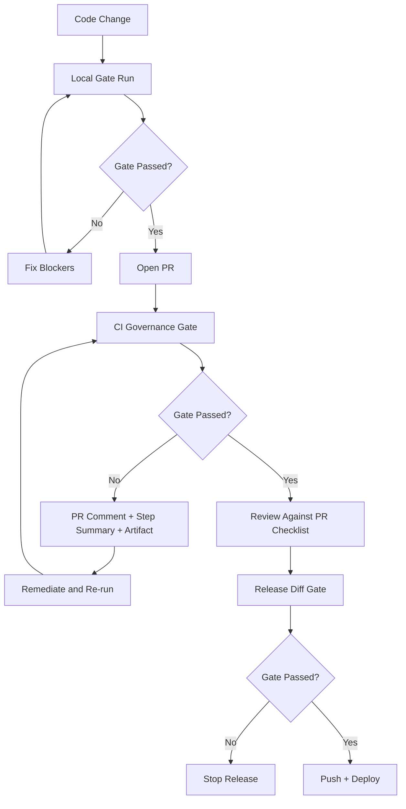

# Airivo Governance One-Page Flow

This page is the shortest executable view of the governance system.

If you only read one governance doc, read this page first, then open:

- `docs/AIRIVO_GOVERNANCE_GATE_RUNBOOK.md`
- `docs/AIRIVO_MAINLINE_DELIVERY_ADJUDICATION_CHECKLIST.md`

## 1) End-to-End Flow



## 2) Minimum Commands

Local full-scan gate:

```bash
bash tools/run_governance_gate_ci.sh
```

Local diff-only gate:

```bash
GOVERNANCE_BASE_SHA="$(git merge-base HEAD origin/main)" \
GOVERNANCE_HEAD_SHA="$(git rev-parse HEAD)" \
bash tools/run_governance_gate_ci.sh
```

Execution attribution hygiene dry-run:

```bash
python tools/backfill_execution_attribution.py \
  --db-path "${AIRIVO_EXECUTION_ATTRIBUTION_HYGIENE_DB_PATH:-data/openclaw.db}" \
  --statuses created,submitted \
  --stale-minutes 30 \
  --max-orders 500
```

Controlled remediation (only when approved):

```bash
python tools/backfill_execution_attribution.py \
  --db-path "${AIRIVO_EXECUTION_ATTRIBUTION_HYGIENE_DB_PATH:-data/openclaw.db}" \
  --statuses created,submitted \
  --stale-minutes 30 \
  --max-orders 500 \
  --apply
```

## 3) Hard Blockers

Do not merge or release when any of the following is true:

- `tools/governance_gate.py` fails
- execution attribution hygiene reports `patched_count > 0`
- required evidence env/artifact is missing for enabled gates
- PR checklist fields are left blank for active scope

## 4) Role Contract

- **Developer**: run local gate, attach artifacts, clear blockers.
- **Reviewer**: verify one scope/one truth/one rollback; reject on ambiguity.
- **Release operator**: run release diff gate before push/deploy.
- **System**: always emit PR comment + step summary + artifact for traceability.

## 5) Completion Definition

A change is governance-complete only when:

1. local gate passes
2. CI gate passes
3. PR checklist is complete
4. release diff gate passes (for release path)
5. no unresolved blocker remains in artifacts

